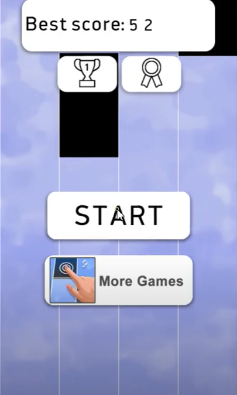

<h1> My Piano Bot </h1>

<h2>Mission: </h2>
Building a Bot that tries to beat the Piano Game using pyautogui and keyboard

<h2>Technology: </h2>
Simply python script!

<h2>Game: </h2>

<h2> Video Demo link: </h2>

    <a href="https://drive.google.com/file/d/1RKOd7K4TssPByZ-j4q_Jk_8X24AGYQaa/view?usp=sharing"> Run PIANO DEMO</a> 

